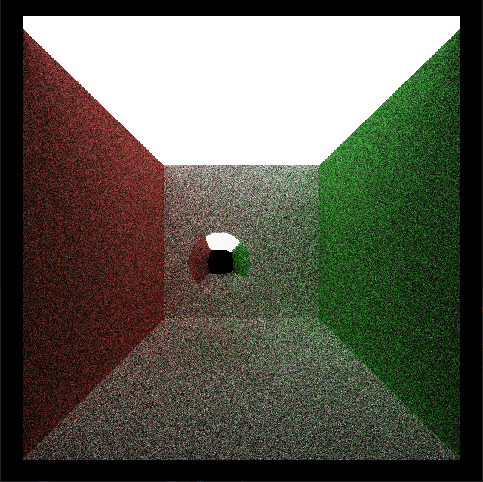
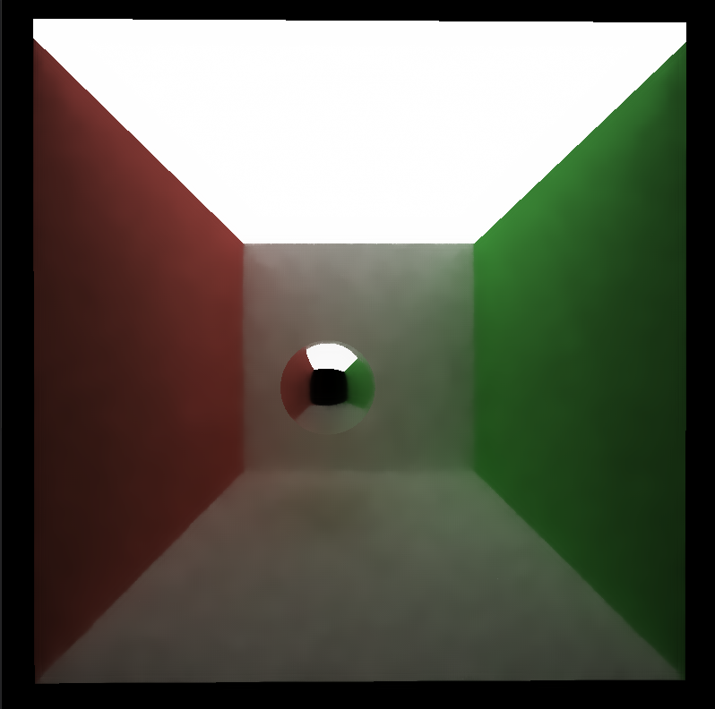
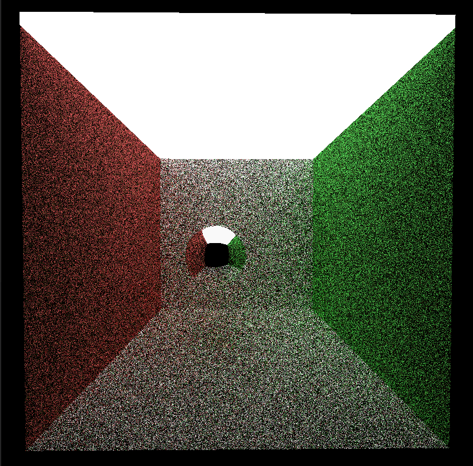
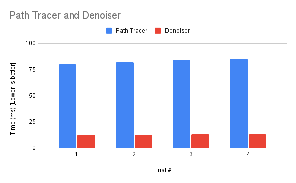
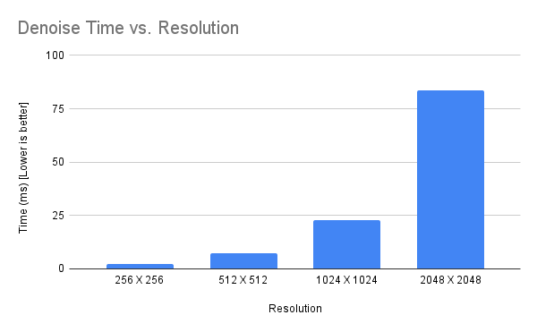
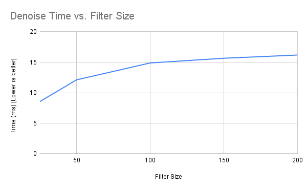

CUDA Denoiser For CUDA Path Tracer
================

**University of Pennsylvania, CIS 565: GPU Programming and Architecture, Project 4**

* Shubham Sharma
  * [LinkedIn](www.linkedin.com/in/codeshubham), [personal website](https://shubhvr.com/).
* Tested on: Windows 10, i7-9750H @ 2.26GHz, 16GB, GTX 1660ti 6GB (Personal Computer).
*GPU Compute Capability: 7.5

## Project Overview
In this project, I implemented a pathtracing denoiser based on "Edge-Avoiding A-Trous Wavelet Transform for fast Global Illumination Filtering" by Dammertz, Sewtz, Hanika, and Lensch. The Denoiser uses geometry buffers (G-buffers) which is convoluted with the original Ray Traced output to provide a smooth result  and therby acting as smoothing filter.

## Algorithm Overview
- The input is a path-traced image,

- Normal buffer 

- Position buffer

The algorithm uses Gaussian filter with increasing step width for multiple iterations to get a denoised result.

# Performance Analysis
The following figures show the renders with different denoising iterations.

All the Images Use The Following Parameters 
- Filter Size = 25
- Color Weight = 8.1000
- Normal Weight = 0.350
- Position Weight = 0.700

## Reference Image (1000 Iterations) 
 
##10 Iterations 
- Reference

- Denoised

## 2 Iterations
- Reference

- Denoised

## Performance Numbers

### Cost Denoiser vs Path Trace

### Denoiser vs Resolution

### Denoiser vs Filter Size

### Notable Findings
- How visual results vary with filter size.
-   - In my Findings the visual results do not change linearly with filter size. As the filter size increase the difference in results become less percieveable 

- how do results compare across different scenes - for example, between cornell.txt and cornell_ceiling_light.txt. Does one scene produce better denoised results? Why or why not?
- - A well Lighted scene will have 

## Optimisations

### G-Buffer optimization
- Opmitimising per-pixel positions and normals which are stored as glm::vec3s results in smaller storage buffers needed to store them and store access times to retreive the data.
- - positions are now reconstructed based on pixel coordinates using an inverted projection matrix.
- - Normals are compacted from glm::vec3 to glm::vec2 saving 4byte per float value stored.

### Comparing A-trous and Gaussian filtering

- A-trous

- Simple Gussian Blur 

| Filter Size | A Trous   |  Simple Gaussian | 
|---|---|---|
| 25 |  8.5991	 |  1.3322 |
| 80 |  13.590	 | 3.1142  |

================
